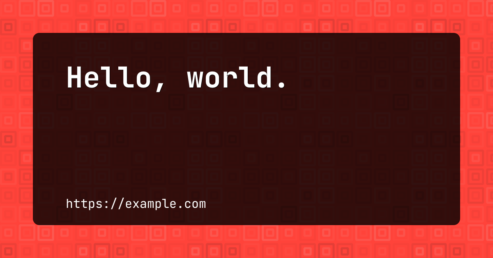

# ogi

`ogi` (**o**pen **g**raph **i**mage) is a tool that generates social media images with a geopattern background.

## Install

```ShellSession
$ go get github.com/soulim/ogi
```

## Usage

```ShellSession
$ ogi --text="Hello, world." \
      --note="https://www.example.com" \
      --width=1200 \
      --height=628 \
      --pattern="nested-squares" \
  > cover.png
```

The command above created `cover.png` file with the following image:



See more examples in [docs/examples](./docs/examples) directory.

**NOTE:** The color of the background depends on the value of the `text` option.
This value is used a seed for color generation. In other words, each text has
it's own color.

## Credits

* ["Programatically generate gorgeous social media images in Go."](https://pace.dev/blog/2020/03/02/dynamically-generate-social-images-in-golang-by-mat-ryer.html) by Mat Ryer
* [JetBrains Mono font](https://www.jetbrains.com/lp/mono/)
* [Go Graphics](https://github.com/fogleman/gg) package for Go
* [`geopattern`](https://github.com/pravj/geopattern) package for Go
* [`oksvg`](https://github.com/srwiley/oksvg) package for Go

Thank you everyone for making `ogi` possible!

## Contributing

PRs accepted.

## License

MIT © Alexander Sulim
