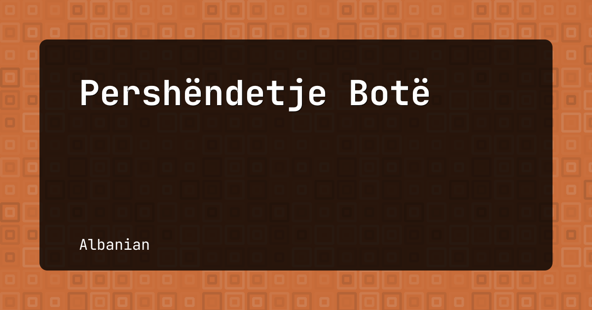
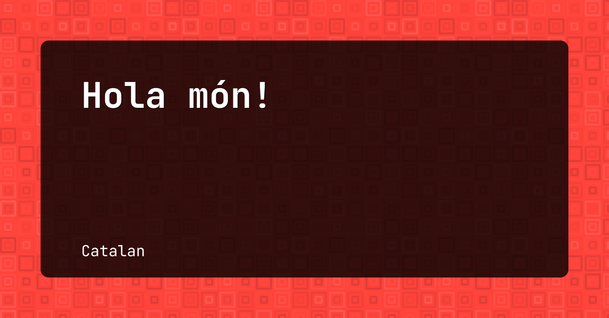
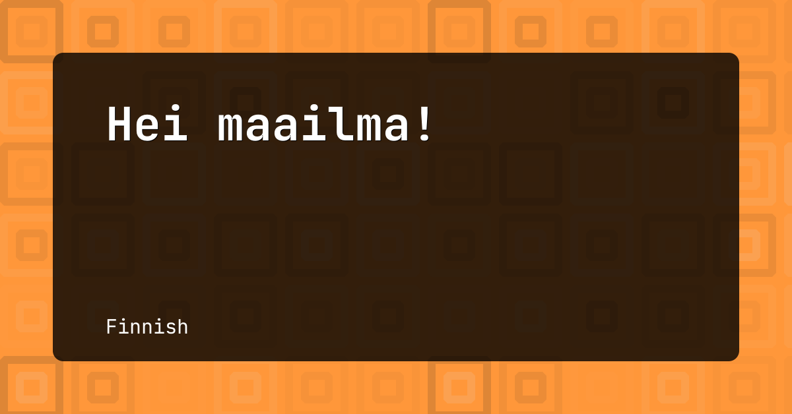
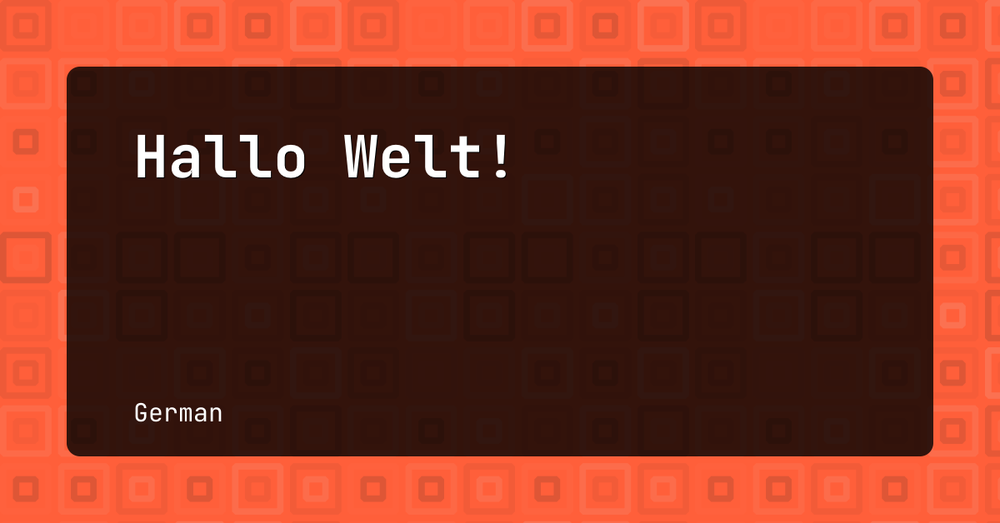
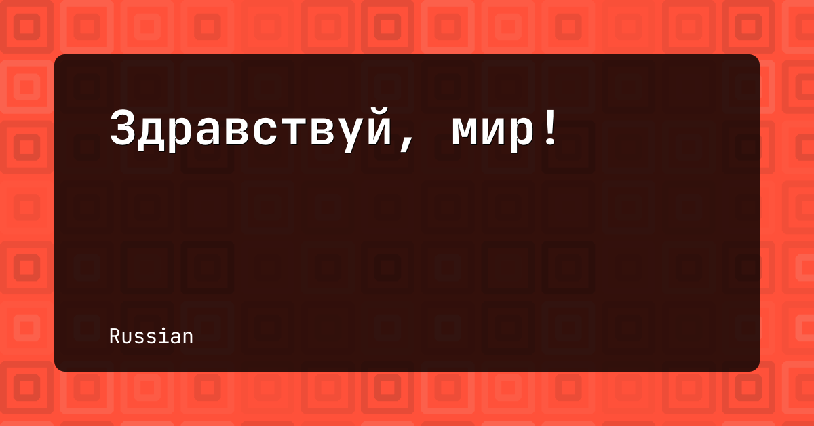
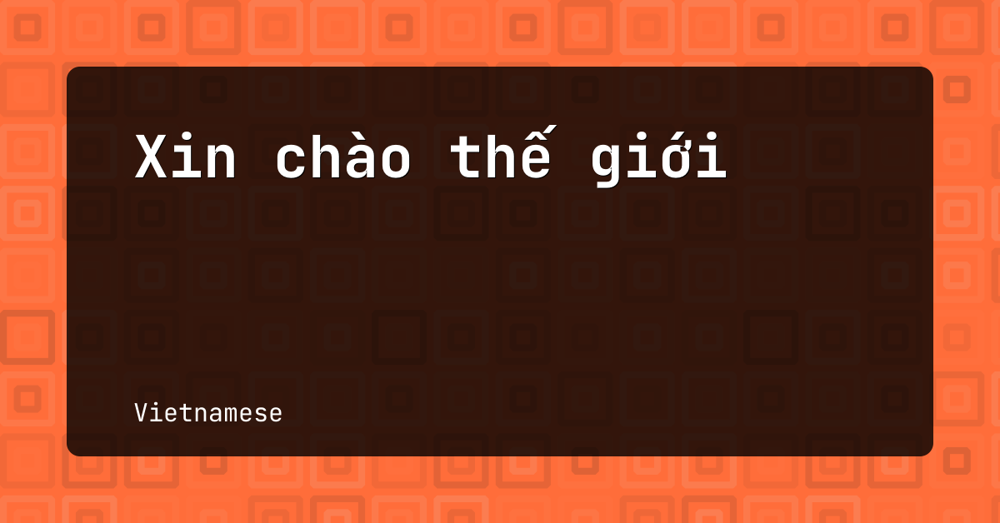

## Examples

Following images are generated with `ogi`. You see "Hello, world!" phrase
written in different languages. Because the text is always different, images
have differnt backgrounds.

---
[The Hello World
Collection](http://helloworldcollection.de/#Human) is used as a source.
